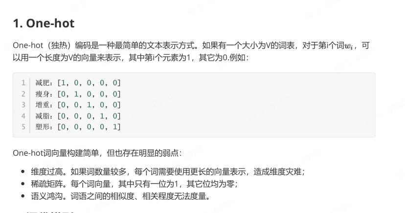

# 线性回归

$$
y = w \cdot x + b
$$


本质是：用一条直线拟合数据


# 逻辑回归

逻辑回归其实是：“线性模型 + 分类器”

第一步:

$$
z = w \cdot x + b
$$

第二步:

$$
\sigma(z) = \frac{1}{1 + e^{-z}}
$$

把任意数字压缩到：(0,1) 于是就能表示概率。


# BP 算法（Backpropagation，反向传播）

$$
L = \frac{1}{n} \sum_{i=1}^{n} (y_{pred}^{(i)} - y_{true}^{(i)})^2
$$

# 激活函数

```
👉 激活函数 = 给神经元加“开关/非线性”
```

## 如果没有激活函数会怎样？

```
👉 无论你：

3 层
10 层
100 层

最终都等价于：

👉 一个线性模型
```

## ReLU（最常用）

$$
f(x) = \max(0, x)
$$

```
👉 特点：

x > 0 → 原样输出
x ≤ 0 → 变成 0

✔ 训练快
✔ 现在深度学习默认选它
```

## Sigmoid

$$
f(x) = \frac{1}{1 + e^{-x}}
$$

```
👉 输出范围：(0, 1)

✔ 常用于二分类（概率）
❌ 容易梯度消失
```

## Tanh

$$
f(x) = \frac{e^x - e^{-x}}{e^x + e^{-x}}
$$  

```
👉 输出范围：(-1, 1)
✔ 输出中心化（有正负）
❌ 也容易梯度消失
```

# CSA：Cross Self-Attention（交叉自注意力）

**核心意思：** 在“自注意力”的基础上，引入“跨输入”的信息交互

**通俗理解：**

- 普通 Self-Attention：一句话自己内部互相看
- CSA：不仅看自己，还可以“看别人”

**举个例子：**

假设你有两个输入：

- 文本 A（问题）
- 文本 B（上下文 / 文档）

CSA 会让：

- A 里的 token 可以关注 B
- B 里的 token 也可以关注 A

👉 本质：不同序列之间的信息融合

**长见于：**

- Encoder-Decoder（比如机器翻译）
- 多模态模型（图文）
- RAG（检索增强生成）

理解: 

CSA：让不同输入“互相看”

HCA：让不同层级 + 不同输入“分层互相看”

# HCA：Hierarchical Cross-Attention（层级交叉注意力）

**核心意思：** 在不同“层级/粒度”上做 Cross-Attention

**为什么需要它：**

长文本 or 多模态任务中：

- 信息是分层的（词 → 句 → 段 → 文档）
- 一次性全 attention 成本太高

**HCA 的做法：**

分层处理：

1. 低层（token级）

    - 细粒度信息（词与词）

2. 高层（chunk / sentence级）

    - 结构信息（段落与段落）

然后：

👉 在不同层之间做 Cross-Attention

**HCA 常见于：**
- 长上下文模型（Long Context LLM）
- 文档级 QA
- 分块检索 + 汇总（Chunk → Summary）

理解: 

CSA：让不同输入“互相看”

HCA：让不同层级 + 不同输入“分层互相看”


# 残差链接

```
输出 = x + F(x)     残差的公式。
x：原始输入
F(x)：这一层学到的新变化
x + F(x)：保留原信息，再加上新信息


Transformer 里基本每个大模块都有残差连接：
输出 = x + Attention(x)
输出 = x + FFN(x)

残差连接到底解决什么？

第一，防止信息丢失
第二，缓解梯度消失
第三，让模型学“变化量”更容易
```

# 稀疏矩阵



# 密集矩阵

